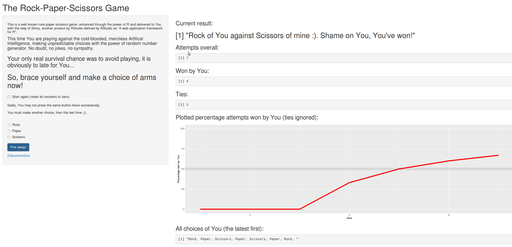

```{r setup, include=FALSE}
knitr::opts_chunk$set(echo = TRUE)
```

  
## The Rock-Paper-Scissors game 
# with R and Shiny  
   
## ..........................
## Author D.Dakhno
## Course Project "Developing Data Products"
## Data Science Specialization by Johns Hopkins University
## Date `r date()`

---

## Introduction and main concepts

The course project is all about building and deploying the Shiny application, accessible 
over Web, dynamic and reactive toward user input. I use the well known simple game to 
build a sample application with a touch of statistics.  
The main features are:
- self-explanatory, responsive user interface ([ui.R] (https://github.com/DDakhno/RockPaperScissors/blob/master/ui.R))
* reactive elements, triggered by user submit
* internal separation of site rendering (shiny) and application logic ([server.R] (https://github.com/DDakhno/RockPaperScissors/blob/master/server.R))
* "session persistence" over iterations



---

## Reactivity and rendering

Following elements are used as user input:
```
checkboxInput(inputId = 'userReset', label = "Start again (reset all counters to zero)",value = FALSE ),
radioButtons(inputId = 'userChoice1', label = "", choices = arms,selected = character(0)),
submitButton('Fire away!')
```
Reaction is asynchron and triggered with user submit (button "Fire away!"), so user has a an option 
to change his choice or to start the next iteration with a blanked history.  
Taking into account the non-conventional behavior of the rendering in shiny, I separate strictly 
the rendering itself and application logic
```
shinyServer(function(input, output, session) {
    renderSite <- function(x) {
        dynout <- wonOrLost(x) 
        output$oid1 <- renderPrint({dynout[[1]]})
        output$oid2 <- renderPrint({dynout[[2]]})
        ...
```

---

## Reactivity and rendering

The function *renderSite* is triggered by observer event
```
#reacting at user triggered reset
    observe({
        if (input$userReset == TRUE) {
            renderSite(NULL)
        }
    })
#reacting at user choice
    observe({
        if (!is.null(input$userChoice1)) {
            renderSite(input$userChoice1)
        }
    })
```
It is not the user input itself, rendered to the output, but the return list of 
the function *wonOrLost()*

---

## Logical layer and session persistance

Function *wonOrLost()* takes the actual user choice as a single argument, generates the random 
choice of application player, compares and returns a list of values (actual result as text, overall number 
of attempts, number of user wins, plays won by user in percent, the same in series, number of ties, 
all user choices) 

```{r echo = FALSE}
arms <<- c("Rock","Paper","Scissors")
nrall <- nrwon <- lp <- ties <- 0
aa <- c()
userChoices <- ""
startt <- TRUE
wonOrLost <- function(y) {
    if (!is.null(y)) {
        nrall <<- nrall + 1
        userChoices <<- paste(y,userChoices, sep = ", ")
        xind <- sample(1:300, 1, replace = F) %% 3 + 1
        yind <- which(arms == y, arr.ind = T)
        os <-
            paste(y, "of You against ", arms[xind], "of mine")
        if (yind == xind) {
            os <- paste(os,
                        "... Tie! Try Your luck one more time...")
            ties <<- ties + 1
        }
        else {
            if (yind - xind == 1 || yind - xind == -2)  {
                os <- paste(os, ":). You've won!")
                nrwon <<- nrwon + 1
            }
            else {
                os <- paste(os, ":(( You, sore looser!")
            }
            lp <<-
                ifelse(nrall > ties, round(nrwon / (nrall - ties) * 100), 0)
        }
        aa <<- c(aa, lp)
    }
    else { #optional reset with x = NULL
        os <- paste("First input yet to be done!")
        nrall <<- 0
        nrwon <<- 0
        lp <<- 0
        aa <<- c()
        userChoices <<- ""
        ties <<- 0
    }
    list(os, nrall, nrwon, lp, aa, ties, userChoices)
}
```
```{r results = "hide"}
for (ch in c("Rock","Scissors")) wonOrLost(ch)
```
```{r strip.white=TRUE, comment="", collapse = TRUE}
paste(wonOrLost("Paper"))
```

## Good luck playing online!


